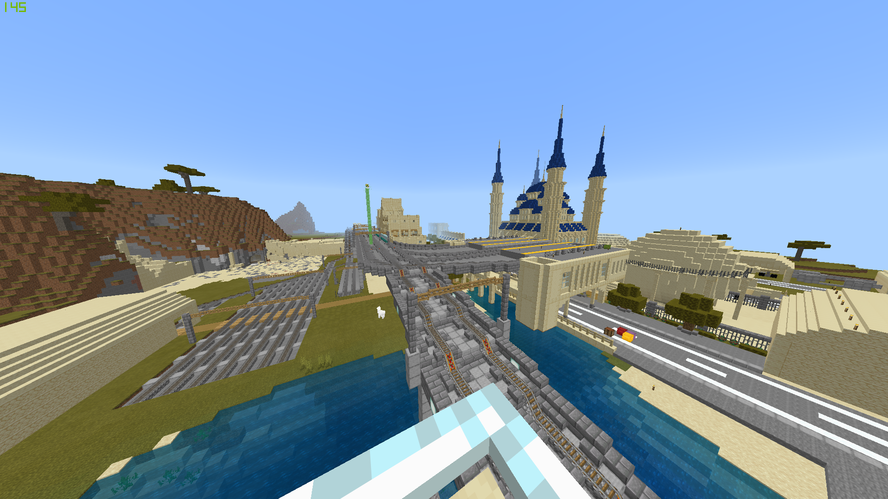

+++
title = "メンバー募集のお知らせ"
date=2022-08-13
[taxonomies]
categories = ["PostMineClan"]
tags = [ "Member","Minecraft"]
[extra]
toc = false
comments = false
+++

# メンバーを募集します！
PostMineClanは、ワールド刷新にあたりサーバーのメンバーを新規募集致します。

本コミュニティは40名を超えるメンバーが在籍しておりながら、高いレベルで民主的な意思決定のプロセスを共有しており、
Minecraftのプレイをはじめ、各種ゲーム・趣味の共有による社会関係資本醸成のお手伝いをさせていただいております。
Minecraftのマルチプレイにご興味ありましたら、是非ご応募ください！

## 募集期間
8月20日まで(Twitter連絡必着)

## 参加要件
1. Minecraft Bedrock Edition(俗にいう統合版)のアカウントを持っている
2. Discordでの連絡が可能である

## 参加手続き
1. [なかむる](https://twitter.com/NakaMCBE)のtwitterへ連絡(DM)
2. Discordフレンド交換
3. Discordボイスチャットによる面接（20分程度）
	- 審査基準にMinecraftの来歴は含まれません。
	- VCミュートでの参加は可能ですが、テキストチャットでのやり取り自体はお願いしています。
4. 承認する場合、Discordグループへの招待URLを送信します。

# さいごに
PostMineClanについて、活動の軌跡はTwitterハッシュタグ `#PostMineClan` 
または、当Webサイトをご参照ください!
 
 
ご不明な点がございましたらお気軽にお問い合わせください。あなたのご参加をお待ちしております!

