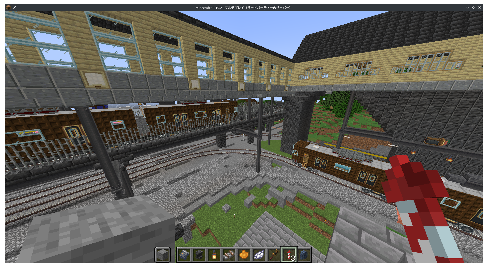
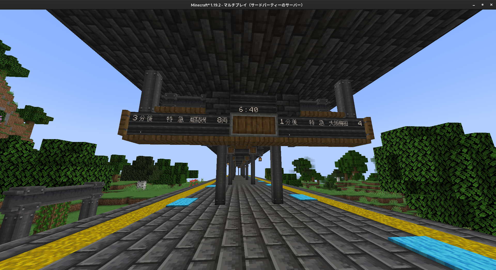

+++
title = "メンバー募集します"
date=2023-03-12
[taxonomies]
categories = ["PostMineClan"]
tags = ["Member","Minecraft"]
[extra]
toc = false
comments = false
+++

# メンバーを募集します！
PostMineClanは、ワールド刷新にあたりサーバーのメンバーを新規募集致します。

本コミュニティは40名を超えるメンバーが在籍しておりながら、高いレベルで民主的な意思決定のプロセスを共有しており、マインクラフトのプレイをはじめ、各種ゲーム・趣味の共有による交友関係構築のお手伝いをさせていただきます。

マインクラフトのマルチプレイにご興味ありましたら、是非ご応募ください！

## 参加要件
- Minecraft Java Editionを所持している
- Discordでの連絡が可能である

# 参加手続き
1. TwitterDMを通した軽いやり取り
2. 体験（数日～数週間）
3. 正式に採用が決まりましたら連絡します

# 求めている人
- 13歳以上であること
- 良識を有していること
- ゲーム以外に趣味があること
- マインクラフト歴は問いません（豆腐建築一個立てられれば可）

# さいごに
PostMineClanについて、活動の軌跡はTwitterハッシュタグ #PostMineClan または、当Webサイトをご参照ください!

ご不明な点がございましたらお気軽にお問い合わせください。あなたのご参加をお待ちしております!

